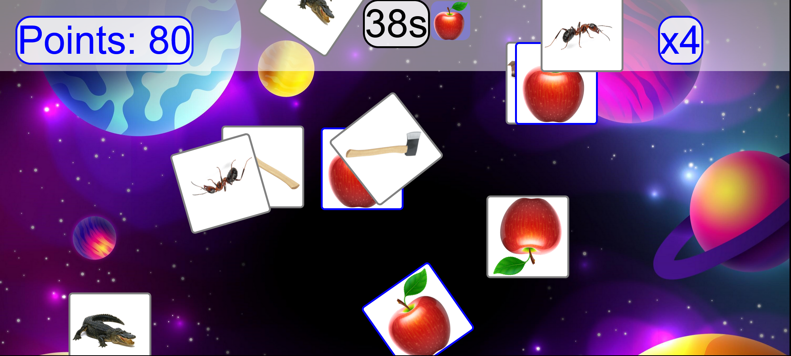

# PictureFall

This is a simple game for ESL teachers in kindergarten classes. This lets you choose some letters and images related to those letters and play a game that involves falling images, where the students have to click the correct falling images.

**[Click Here to Try it now!](https://needtoupdate.github.io/PictureFall/)**

---

# How To Play

Double click index.html and open it in any browser. You do not need internet.

Choose a letter (up to 4) to play with.

You can choose to use animal pictures, or character pictures.

Animals will just be the images in the /animals/ folder, characters are just the images in the /characters/ folder. Words are the wordlists in the CUSTOM_WORDS.txt file.

Then choose today's images (up to 20). Press the checkmark in the top left corner.

Then pick the one image to use, and press GO.

---

## Example

For example, Today you are doing letter B.

1. Press B on the keyboard, press the checkmark key.

2. The words you want today are just "Ball, Bee, Balloon, Bear" and don't need the others.

   - Select the 4 wanted words, and press the green checkmark in the top left corner.

3. Ask a student (or two) to come up to the board. They can choose what they want to use.

   - The student picks 'Balloon'

4. Click the other 3 images, so only Balloon is visible.

5. Press GO in the top left corner.

   - The student will have 60 seconds to find all the Balloons. Clicking correct choices raises the combo score.

6. The score will be shown after 60 seconds. Press the OK button in the top left corner.

7. Go back to step 3 for the rest of the students.

---

# How To Update Images

If you wish to update images in the game, you must run the update_images.py file.

Add images to the images folder. You can either add them to the main folder, or add them to the specific letters. For example, if you want the word 'Fox' to appear when you click 'X', make sure 'fox.png' is in the /x/ folder. Otherwise it
will appear in the 'F' section since it starts with 'F'.

If you want to add a custom wordlist, like "tennis, gymnastics, volleyball, judo, pingpong, basketball", you can add the images to the folder, then add the words into CUSTOM_WORDS.txt. Then when you run update_images.py, your wordlist will
appear in the 'words' option in the game.

If this is the first time you use python, follow the following instructions:

### ON WINDOWS:

1. Go to /Install Python/
2. Double click 'python windows.exe'. Install it.
3. Use the update_images.py file to update the images!

### ON MAC:

1. Go to /Install Python/
2. Double click 'python mac.pkg'. Install it.
3. Double click the update_images.py file. It will open Idle
4. Click 'run' or F5
